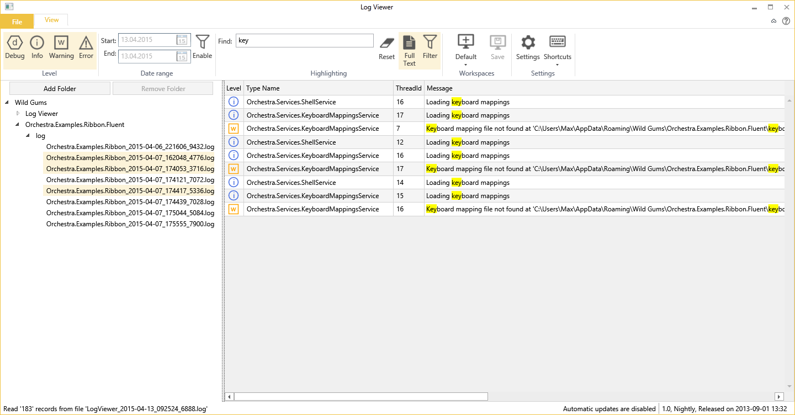

LogViewer
===========

LogViewer is a simple application used to read log files created by the Catel logger.

It is also used as an example on how to build an application using [Orchestra](https://github.com/WildGums/Orchestra) and the various [Orc.* libraries](https://github.com/WildGums).

## Features

* Build-in filesystem browser with multiselection support:
    - Easily switch between log files
    - View multiple log files together
* Search (with highlighting)
* Fitler by:
     - Log level (Error, warning, info, debug)
     - Date range
     - Keyword

## How to get it

The tool is available in several ways:

1. Build it from source
2. Download it here: (includes automatic updates):
   - [Stable with support for updates](http://downloads.sesolutions.net.au/logviewer/stable/logviewer.exe)
   - [Beta with support for updates](http://downloads.sesolutions.net.au/logviewer/beta/logviewer.exe)
   - [Alpha with support for updates](http://downloads.sesolutions.net.au/logviewer/alpha/logviewer.exe)

*Note that you can switch the update channel in the settings*

## Screenshots

## License

MIT license
